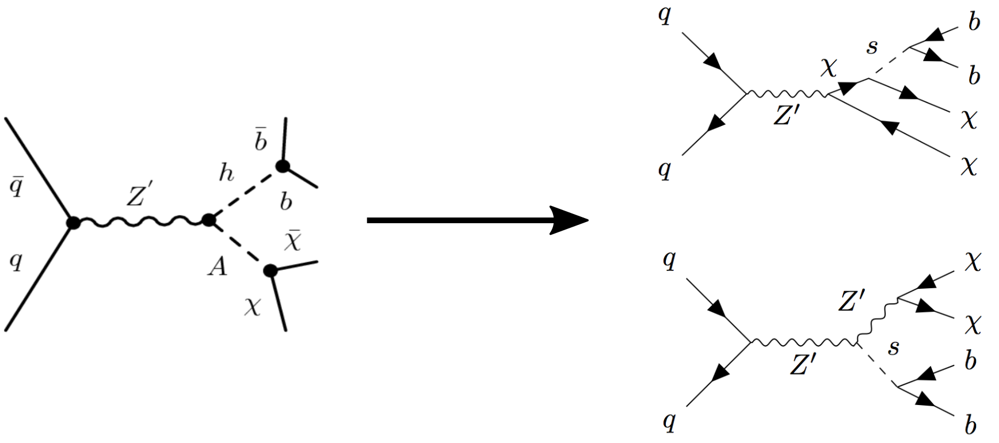
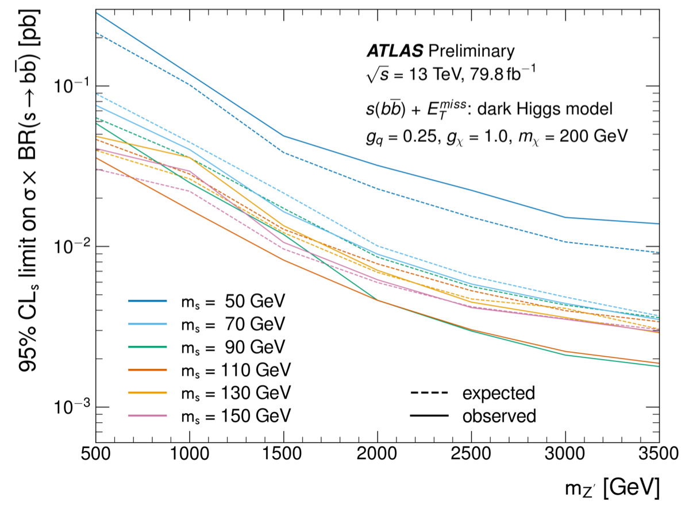

## Introduction
The docker tutorial introduced you to containerization as an industry-standard computing tool that makes it quick and easy to use a customized computing environment that suits the needs of your application. In this tutorial, we'll explore how ATLAS is leveraging the power of containerization for data analysis applications. You've already seen that standard ATLAS computing tools can be packaged into the `atlas/analysisbase` docker image, which lets you develop an analysis on your local machine. Now we'll see how ATLAS is using docker and CI/CD to preserve and re-interpret ATLAS analyses using a tool called RECAST (Request Efficiency Computation for Alternative Signal Theories).

As mentioned, there are two main components to recast: preservation and reinterpretation. Preservation involves saving the software environment, workflow and data files needed to reproduce an analysis. We'll talk more about how to do this using docker and CI/CD in the latter half of the tutorial. Reinterpretation involves using a preserved analysis to analyze signal samples from a new theoretical model. For now, this is done using command-line tools , which will be the subject of the first half of the tutorial. The main focus will be on `recast-atlas`, but we'll also talk about a newer tool `recast-cli`.

With `recast-atlas`, we'll see how to calculate CLs upper limits for a new signal model by using an existing analysis and ATLAS full simulation. For our signal model, we'll use MonoSbb (dark Higgs boson decaying to two b-quarks) and for our existing analysis, we'll use MonoHbb. As it would take too long to run a full signal grid and get a complete contour, we'll only consider a single signal point. 

`recast-cli` is similar to `recast-atlas`, except it uses fast simulation tools (e.g., rivet) -- no geant4 detector simulation. Since this is significantly faster (it's in the name, after all), we'll calculate a full contour. Without full simulation, you avoid the need to request derivations, so it can be used to quickly check a model, or to help determine the signal grid for a later reinterpretation using full simulation. For our signal model, we'll use (insert signal model here) and for our existing analysis, we'll use (insert existing analysis here).

If you still have time after these activities, there will be an advanced section at the end of the tutorial that has additional information on how a new analysis can be preserved for RECAST.

### Plausible and Likely Scenario

To understand why analysis preservation, and RECAST in particular, is useful, consider that it can take months or even years for a multi-person analysis team to develop cuts that optimally carve out a phase space sensitive to the model they want to test, and estimate the standard model backgrounds and systematics in this phase space.

Years later, other physicists may dream up new theories leading to alternative models that would show up in the same or similar phase space. Since the cuts and standard model background estimates won't be affected by considering different signal models in the same phase space, it would probably be way faster for them just to make some tweaks to the original analysis to re-run it with the new models. But the original analysts have moved on, and even if they can dig up the analysis code, they may not remember exactly how to use it or what sort of environment they were running it in.

This is where RECAST comes in! RECAST, [initially developed during Run1 of the LHC](https://link.springer.com/article/10.1007%2FJHEP04%282011%29038) is a part of a broader effort called [REANA](http://www.reanahub.io/) which aims to improve the reproducibility of particle physics data analysis.  These efforts are all part of a broader effort of [analysis preservation](https://www.nature.com/articles/s41567-018-0342-2) ongoing at CERN.  RECAST in particular, the tool you will be learning about here, automates the process of passing a new signal model through an analysis at the time that the analysis is being developed. The idea is that the analysis can then be trivially reused at any time in the future to re-interpret new signal models in the phase space that it so painstakingly revealed.

> ## RECAST in Action
> The mono-Hbb dark matter search that we're analyzing was formally reinterpreted by ATLAS ([link to paper](https://cds.cern.ch/record/2686290)).
> 
> 
{: .callout}

## Three Key Components of RECAST

### Analysis code preservation

Analysts write a custom code framework that they pass data and signal/background MC through to search for a particular physics model in the data. The first part of analysis preservation is therefore to preserve this code framework. Gitlab is great for this. It fully preserves not only the final version of the code, but also every single version and offshoot of the code that was ever used by the analysts.

### Environment preservation

But as we've seen, the code framework is far from standalone. It relies on having specific libraries, compilers, and even operating systems in place, and it may be really fussy about the exact versions of all these dependencies. So the second part of analysis preservation is to capture the exact environment in which the code was run by the original analysts. This is where docker comes in.

ATLAS has developed [version-controlled docker base images](https://hub.docker.com/u/atlas) that encapsulate the OS, compilers, standard libraries, and ATLAS-specific dependencies commonly used in ATLAS analyses. You've already had a chance to work with one of them, `atlas/analysisbase`. Individual searches design custom Dockerfiles in the Github repo(s) to add the analysis code to the base image, along with any analysis-specific dependencies, and then build the code to produce the exact environment needed to run it.

### Automated re-interpretation

The third and final piece of analysis preservation is to fully automate the steps that an analyst would go through in order to pass a new signal model through the analysis chain to arrive at the new result. This is accomplished using a tool called yadage, which allows the user to codify each step of the analysis, which analysis environment (i.e. container) a given step needs to run in, and how each step fits into the overall analysis workflow to arrive at the final result.

> ## Other RECAST resources
> In addition to this tutorial, there are many other resources available for RECAST, including:
>
> ### RECAST documentation
> * Excellent [RECAST documentation](https://recast-docs.web.cern.ch/recast-docs/) written by Lukas Heinrich, which is borrowed from extensively for this tutorial.
>
> ### Slides from past tutorials
> * [Exotics Tutorial 2018-11-19](https://indico.cern.ch/event/771214/)
> * [Exotics Tutorial 2018-11-12](https://indico.cern.ch/event/768607/)
> * [SUSY Tutorial 2018-11-08](https://indico.cern.ch/event/763748/)
> * [Docker Tutorial Induction Week 2019-01-31](https://indico.cern.ch/event/772589/contributions/3210539/attachments/1788754/2913246/DockerSWTutorial.pdf)
> * [GitLab Tutorial Induction Week 2019-01-31](https://indico.cern.ch/event/772589/contributions/3210424/attachments/1788725/2913191/20190131_ContinuousIntegration_ATLASInductionWeek.pdf)
>
> ### Communication channels
> * [Mattermost Channel](https://mattermost.web.cern.ch/atlas-ap/channels/town-square)
> * **Mailing list:** atlas-phys-exotics-recast@cern.ch
> * [Discourse](https://atlas-talk.web.cern.ch/c/recast)
>
> ### Talks
> [ATLAS Weekly Talk on Analysis Preservation](https://indico.cern.ch/event/793316/contributions/3295488/attachments/1786861/2909640/AP_RECAST_Weekly.pdf)
{: .callout}



