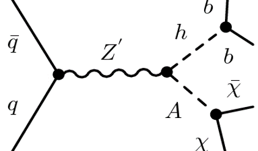
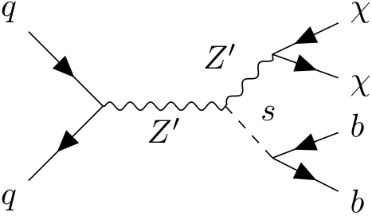

## Introduction
Now we'll dive into the details of the atlas-specific recast tool: `recast-atlas`. To start with, we'll reproduce (some of) the results of the monosbb recast. These results can ultimately be used to produce the final exclusion contours over the model phase space, as seen here:

### Full Simulation
There are many resources on the ATLAS tool chain, see e.g. [this talk]("https://indico.cern.ch/event/472469/contributions/1982677/attachments/1220934/1785823/intro_slides.pdf") or the [twiki](https://twiki.cern.ch/twiki/bin/viewauth/AtlasProtected/DerivationFramework#What_is_the_derivation_framework). The most important aspect for `recast-atlas` is that all of the steps from generation up to derivation are handled by other atlas tools, so `recast-atlas` only handles the *analysis* stage, which essentially boils down to event selection and statistical analysis.

Therefore, if you wish to reinterpret an analysis, you'll need to find out what derivation they used and create appropriate samples for your new signal model (note that you *only* need to worry about the signal; the backgrounds should already be included by the recast implementation of the analysis).

Depending on whether the analysis is in the `recast catalogue` or not, you may also need the analysis' github repository for their recast implementation. In the example below, we'll use the monohbb analysis, which is included in the recast catalogue, but later we'll discuss how to handle the other situation.

## Example
While it's not strictly necessary to know any details regarding the mono-Sbb re-interpretation in order to follow this example, it's nice to have a bit of context. Therefore, the next two subsections discuss the mono-Hbb analysis and dark Higgs model that together comprise the mono-Sbb re-interpretation.

### Mono-Hbb Analysis
> 
> A Feynman diagram showing the leading-order contribution to production of dark matter in the mono-Hbb analysis. _Z_' is a new mediator between the dark and visible sectors, which is coupled to a new pseudo-scalar Higgs boson _A_ and a standard model Higgs boson _h_. _A_ decays to two dark matter particles _χ_.

The Mono-H(bb) analysis searched for dark matter (DM) production in association with a Higgs boson decaying to two _b_-quarks from _pp_ collision at a centre-of-mass energy of 13 TeV. The dataset was recorded by the ATLAS experiment in 2015 - 2017 and corresponds to an integrated luminosity of 79.8 fb-1. The original results were interpreted using a Z'-2HDM signal model.

The signature of the search was:
1. MET (missing transverse energy) from the dark matter.
2. 2 _b_-tagged jets from the _h_ decay.

The data was split into four bins based on MET. At high energies, the _b_ jets become harder to resolve and 'merge' into a single 'fat' jet. Due to this, a different strategy was used in the 'merged' MET bin than was used in the three 'resolved' MET bins. 

Additionally, several control regions were defined based on the number of isolated leptons. These control regions were then used in statistical analysis to constrain background parameters.

### Dark Higgs Model
> 
> A leading-order Feynman diagram for the dark Higgs model in the mono-Sbb analysis. The similarity to mono-Hbb motivates re-interpretation.

For the mono-Sbb re-interpretation, a new dark Higgs signal model was used. In addition to _Z_', the model introduces a Higgs mechanism in the dark sector that is responsible for the Majorana DM particle _χ_ obtaining its mass. The dark Higgs mechanism results in a physical dark Higgs boson _s_. If _s_ is lighter than _χ_, the DM relic abundance can be accounted for by _χ_→_ss_ where _s_ then decays to SM states. This also leads to processes (an example is shown above) that have similar experimental signatures to the mono-H analysis: MET from _χ_ and two _b_-jets (with mass _m__s_ instead of _m__h_). 

The model has four free parameters: the mass of the particles _m__χ_, _m__Z'_, _m__s_ and the coupling _g__χ_. In this re-interpretation, _g__χ_=1 (as was done in the Z’-2HDM model) and _m__χ_=200 GeV. Then, the signal grid is given by _m__Z'_∈[500, 3000] GeV in steps of 500 GeV and _m__s_∈[50, 110] GeV in steps of 20 GeV, resulting in a total of 24 points.

## Results
There are two ways to run `recast-atlas`: locally or on lxplus.
> ### Local
> To install `recast-atlas` locally, first setup a python virtual environment in whatever manner you prefer (conda, venv, etc.). Then, within that environment run:
~~~
pip install recast-atlas
~~~
 
> ### lxplus
> To use `recast-atlas` on lxplus, you need to ssh into a special lxplus node: `ssh username@lxplus-cloud.cern.ch`. Then, run:
~~~
source ~recast/public/setup.sh
~~~

In either case, if setup was successful then running `recast --help` should display usage information for recast-atlas.

The `recast-monosbb` workflow is available at the following url: https://gitlab.cern.ch/recast-monosbb/workflow/-/tree/master. The README describes how to use several scripts to run the full signal grid. 



