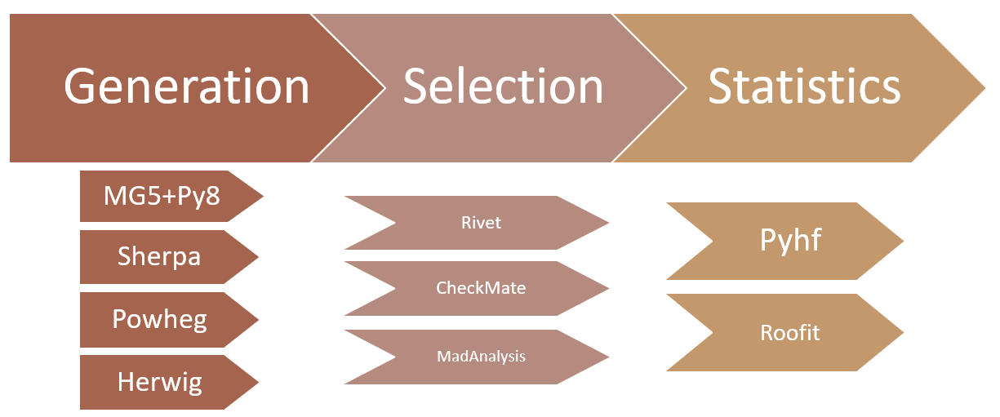

## Introduction
Now we'll take a look at the other recast tool: `recast-cli`. Unlike `recast-atlas`, `recast-cli` does not use ATLAS analyses in their original form. Instead, it uses 'shortcuts' such as fast simulation, that speed up the results, but are not quite as accurate. This also means that events are generated and simulated as part of the `recast-cli` workflow, rather than through the ATLAS derivation system. 

So, if it's less accurate, why should we use it? The primary use-case for `recast-cli` inside of ATLAS is at the early stage of a reinterpretation. Creating a signal grid of full simulation samples is expensive, so you would like to make sure that you select useful points in phase space. `recast-cli` can help quickly confirm that the points you've selected are interesting, or perhaps indicate that you should move in a different direction (either by selecting a different signal grid, or using a different analysis).

> ### Fast Simulation
> The principal motivation for `recast-cli` is the use of fast simulation. Fast simulation uses kinematic smearing or other techniques to simulate detector effects, rather than going through a full geant-4 emulation (see [rivet](https://arxiv.org/abs/1910.01637) for more details).
{: .callout}

## Example
### Analysis
TODO: Add description of [analysis](https://arxiv.org/abs/1605.03814)
### Model
TODO: Add description of [model](http://feynrules.irmp.ucl.ac.be/wiki/DMsimp)

## Installation

### Using docker
A recast-cli docker image for this tutorial is available on docker hub at: `insert-image-here`. Simply run:
~~~
docker run --rm -it replace/me/with/image:tag bash
~~~

### Using pip
> ## Python virtual environments
> There are many ways of [managing](https://packaging.python.org/tutorials/managing-dependencies/) Python packages. Most people in the Physics community use [conda](https://docs.conda.io/en/latest/), but there are other options such as [pipenv](https://pipenv-fork.readthedocs.io/en/latest/), [venv](https://docs.python.org/3/library/venv.html), and [poetry](https://python-poetry.org/). It is best practice to install any Python packages within a virtual environment controlled by one of these systems, rather than using the base Python environment on your machine.
{: .callout}
In your favorite python virtual environment, run:
~~~
git clone https://github.com/vladov3000/recast_workflow.git
pip install ./recast_workflow
~~~
This should add `recast-wf` to your path.

## Creating a Workflow
`recast-cli` is essentially an automated Yadage workflow creation/run tool (see later sections for details on Yadage -- we'll need to know how to use it when we preserve our analysis). To begin, run `recast-wf make new`. A list of possible workflows combining various tools (such as [rivet](https://rivet.hepforge.org/), [madgraph](http://madgraph.phys.ucl.ac.be/), and [contur](https://hepcedar.gitlab.io/contur-webpage/)) should be shown. 

> ## Recast-cli Catalogue
> Recast-cli organizes the various physics tools into several 'steps' (see figure below). For each step, you can choose which tool you would like to use and specify the relevant settings.
> 
{: .callout}
Before selecting a combination, you can enter additional 'common inputs'. In this case, we need to enter the inspire ID of the analysis we want to use. `recast-cli` will automatically query the databases of the tools in the 'selection' step to determine which ones have implemented this analysis and filter the available combinations accordingly. To continue, enter:
~~~
analysis_id=ATLAS_2016_I1458270
done
~~~
Next, enter the number corresponding to the combination that includes `madgraph_pythia`, `rivet` and `contur`. Save it to inventory and show it. 

## Running a Workflow
Your identified workflow should now be in the inventory. To confirm, run `recast-wf inv ls`; you should see `madgraph_pythia-rivet-contur`. To retrieve it from the inventory, run:
~~~
recast-wf inv getdir madgraph_pythia-rivet-contur .
cd madgraph_pythia-rivet-contur
ls
~~~ 
This copies the workflow into a `madgraph_pythia-rivet-contur` directory within your current directory. You should see three items:
~~~
inputs		run.sh		workflows
~~~
`workflows/workflow.yml` contains the full Yadage workflow that was previously generated. `run.sh` is a helper script that contains the necessary Yadage command to run the workflow. `inputs` is where you should place all of your input files. It also contains an `input.yml` file that maps input names to values. Open `input.yml`. It should look like this:
~~~
      analysis_id: null
      n_events: null
      proc_card: null
~~~
These are the inputs that need to be specified for this workflow. `analysis_id` we already know should be `ATLAS_2016_I1458270`. For `n_events`, let's choose 1000. `proc_card` is a madgraph process card; we need to specify the process we would like to generate. Enter `proc_card_dm.dat`; we'll create this file in a moment. Note that all paths are relative to the inputs directory. With all the inputs specified, it should look like this:
~~~
      analysis_id: ATLAS_2016_I1458270
      n_events: 1000
      proc_card: proc_card_dm.dat
~~~

With this done, make `proc_card_dm.dat` in the inputs directory. To simulate a mono-jet DM process, write the following:
~~~
        import model DMsimp_s_spin1 --modelname
        generate p p > xd xd~ j
~~~

With the inputs specified, run `run.sh`:
~~~
cd ..
./run.sh
~~~

### Results
The results of the run are in `workdir`. In `workdir/contur/ANALYSIS/Summary.txt` you can view the CLs:
~~~
Run Information 
Contur is running in /contur on analysis objects in ['/mnt/c/Users/alexj/work/atlas_computing_workshop/recast_workflow_tutorial/madgraph_pythia-rivet-contur/workdir/rivet/rivet_analysis.yoda']
Excluding Higgs to WW measurements 
Building all available data correlations, combining bins where possible 
Building default background model from data, ignoring optional theory predictions (excluding ratios) 

Parameter values not known for this run.
Combined exclusion for these plots is 97.85 % 

pools
ATLAS_13_METJET
0.97852174284
/ATLAS_2016_I1458270/2jm
~~~

> ## Bonus Exercise!
> `recast-cli` can also automate a scan over a grid. TODO: add instructions for scan.
{: .challenge}



